# ClinicAssistant User Guide

ClinicAssistant is a desktop app that offers seamless patient contact management for GP clinics’ admin staff who are familiar with Command Line Interface (CLI), 
optimized for use via a CLI while still having the benefits of a Graphical User Interface (GUI). 
If you can type fast, ClinicAssistant can get your patient record management tasks done faster than traditional pen-and-paper methods. 
It ensures efficient adding, editing and finding of patient information, optimising clinic operations.
<!-- * Table of Contents -->
- **Introduction**
    - [Target Audience](#target-audience)
    - [How to Use the Guide](#how-to-use-the-guide) 
- **Getting Started**
    - [Quick start](#quick-start) 

- **Features and Commands**
    - [Adding a person: `add`](#adding-a-patient-add)
    - [Adding a doctor: `add_doctor`](#adding-a-doctor-add-doctor)
    - [Adding an appointment: `appt`](#adding-an-appointment-appt)
    - [Listing all patients : `list`](#listing-all-patients-list)
    - [Listing all appointments : `list_appt`](#listing-all-appointments-list-appt)
    - [Editing a patient: `edit`](#editing-a-patient-edit)
    - [Editing an appointment: `edit_appt`](#editing-an-appointment-edit-appt)
    - [Deleting a patient : `delete`](#deleting-a-patient-delete)
    - [Deleting a doctor : `delete_doctor`](#deleting-a-doctor-delete-doctor)
    - [Deleting an appointment : `delete_appt`](#deleting-an-appointment-delete-appt)
    - [Finding patient details by name: `find`](#finding-patient-details-by-name-find)
    - [Finding patient details by nric: `find_nric`](#finding-patient-details-by-nric-find-nric)
    - [Finding appointment by patient name or date: `find_appt`](#finding-appointment-by-patient-name-or-date-find-appt)
    - [Viewing available timeslots : `view`](#viewing-available-timeslots-view)
    - [Clearing all patients : `clear`](#clearing-all-patients-clear)
    - [Exiting the program : `exit`](#exiting-the-program-exit)
    - [Saving the data](#saving-the-data)
    - [Editing the data file](#editing-the-data-file) 

- **Additional Information**
    - [FAQ](#faq)
    - [Known issues](#known-issues)
    - [Command summary](#command-summary)

<page-nav-print />

### Target Audience

ClinicAssistant is for **general practitioner (GP) clinics' staff** who want to keep track of their patients' records and appointments.
Clinic staff often have to manage a large number of patients and appointments, and ClinicAssistant helps them to do so more efficiently.
ClinicAssistant allows clinic staff to add, edit, delete, find and list patients and appointments. It also allows viewing of available timeslots for appointments for a given date to allow for easy booking of appointments.

### How to use the guide

|   If you are   |                                               You should                                                |
|:--------------:|:-------------------------------------------------------------------------------------------------------:|
|   a new user   | proceed to our [quick start](#quick-start) section to set up the necessary details and try our features |
| returning user |      skip to our [command summary](#command-summary) for an in-depth summary of all our features!       |

## GUI explanation

In order to have a better experience in using **ClinicAssistant**, please take a look at this explanation of the GUI.
### Main Window
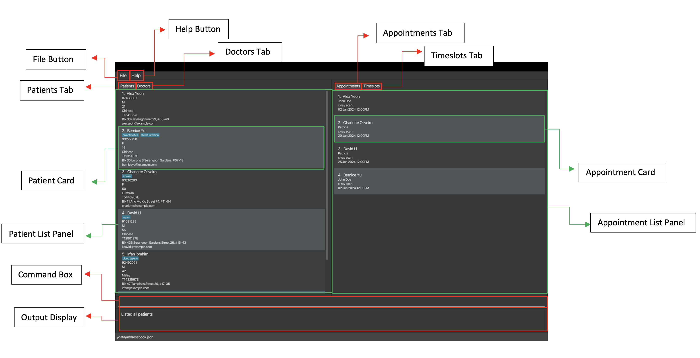

| GUI element (red) |                                            Description                                            |
|:-----------------:|:-------------------------------------------------------------------------------------------------:|
|    Help Button    |                                A button that opens the help menu.                                 |
|    File Button    |                         A button that allows you to exit the application.                         |
|    Command Box    |                  A text field that allows you to enter a command to be executed.                  |
|  Output Display   | A text display that displays any information regarding command inputs, such as success or errors. |
|   Patients Tab    |                  A tab that shows the Patient List Panel on screen when clicked.                  |
|    Doctors Tab    |                  A tab that shows the Doctor List Panel on screen when clicked.                   |
|   Timeslots Tab   |                 A tab that shows the Timeslot List Panel on screen when clicked.                  |
| Appointments Tab  |                A tab that shows the Appointment List Panel on screen when clicked.                |

|  GUI element (green)   |                                               Description                                               |
|:----------------------:|:-------------------------------------------------------------------------------------------------------:|
|   Patient List Panel   |                       A Panel that contains a list of Patients inside the system.                       |
|      Patient Card      |               A card that shows the details of the Patient such as name, age, gender, etc               |
| Appointment List Panel |                     A Panel that contains a list of Appointments inside the system.                     |
|    Appointment Card    | A card that shows information on Appointments such as name of Patient, name of doctor, and date & time. |
|   Doctor List Panel    |                       A Panel that contains a list of Doctors inside the system.                        |
|      Doctor Card       | A card that shows information on doctors such as name, gender, email, age, address, and contact number. |
|  Timeslot List Panel   |                   A Panel that contains a list of empty Timeslots inside the system.                    |
|     Timeslot Card      |                                A card that shows what timeslot is free.                                 |
|          Date          |                                 Shows the date of the time slots shown                                  |

--------------------------------------------------------------------------------------------------------------------

### Patient Card
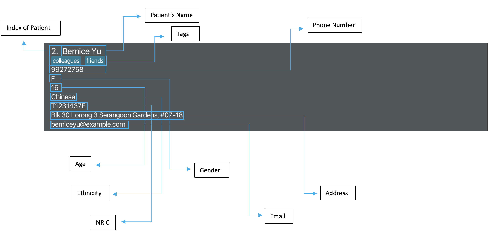

--------------------------------------------------------------------------------------------------------------------

### Doctor Card
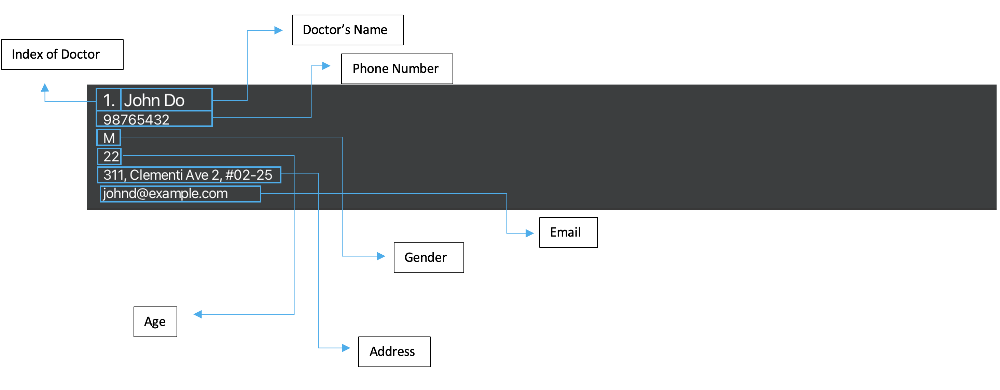

--------------------------------------------------------------------------------------------------------------------

### Appointment Card
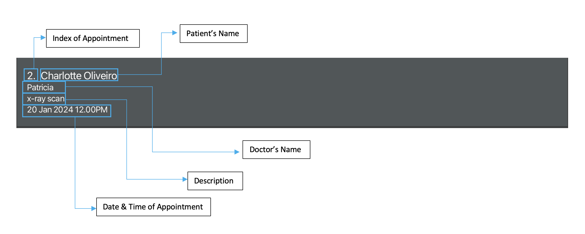

## Quick start

1. Ensure you have Java `11` or above installed in your Computer.

1. Download the latest `clinicassistant.jar` from [here](https://github.com/AY2324S1-CS2103T-W09-3/tp/releases).

1. Copy the file to the folder you want to use as the _home folder_ for your ClinicAssistant.

1. Open a command terminal, `cd` into the folder you put the jar file in, and use the `java -jar clinicassistant.jar` command to run the application.
   A GUI similar to the below should appear in a few seconds.  
   

1. Type the command in the command box and press Enter to execute it. e.g. typing **`help`** and pressing Enter will open the help window. 
   Some example commands you can try:

* `list` : Lists all patients in the ClinicAssistant.

* `add /n John Doe /p 98765432 /e johnd@example.com /g M /age 22 /eth Chinese /ic T1234567E /a 311, Clementi Ave 2, #02-25 /t allergic to the sun /t history of knee problems` :
  Adds a patient named `John Doe` to ClinicAssistant the specified details such as male `M`, ethnicity `Chinese` and IC number `T1234567E`.

* `delete 3` : Deletes the 3rd patient shown in the current list of ClinicAssistant.

* `appt /for 1 /doc 1 /d description details /on 02-01-2024 12:00` : Adds an appointment with specified Doctor index, description and time to the patient identified with `INDEX` 1 in the list.

* `view /on 02-01-2024` : Displays all available timeslots that can be booked for an appointment on 02 Jan 2024.

* `clear` : Deletes all patients.

* `exit` : Exits the app.

1. Refer to the [Features](#features) below for details of each command.

## Features

<box type="info" seamless>

**Notes about the command format:** 

* Words in `UPPER_CASE` are the compulsory parameters to be supplied by the user. 
  e.g. in `add /n NAME`, `NAME` is a parameter which can be used as `add /n John Doe`.

* Items in square brackets are optional. 
  e.g `/n NAME [/t TAG]` can be used as `/n John Doe /t smoker` or as `/n John Doe`.

* Items with `…`​ after them can be used multiple times including zero times. 
  e.g. `[/t TAG]…​` can be used as ` ` (i.e. 0 times), `/t smoker`, `/t torn ACL /t diabetes` etc.

* Parameters can be in any order. 
  e.g. if the command specifies `/n NAME /p PHONE_NUMBER`, `/p PHONE_NUMBER /n NAME` is also acceptable.

* Extraneous parameters for commands that do not take in parameters (such as `help`, `list`, `exit` and `clear`) will be ignored. 
  e.g. if the command specifies `help 123`, it will be interpreted as `help`.

* All commands are case-sensitive.  
  e.g. `delete 1` will work, but `Delete 1` or `DELETE 1` will not work.

* **If you are using a PDF version of this document, be careful when copying and pasting commands that span multiple lines as space characters surrounding line-breaks may be omitted when copied over to the application.**
</box>

--------------------------------------------------------------------------------------------------------------------

### Adding a patient: `add`

Adds a patient to the clinic records.

Format: `add /n NAME /p PHONE_NUMBER /e EMAIL /g GENDER /a AGE /eth ETHNICITY /ic NRIC /a ADDRESS [/t TAG]…​`
* A patient has a name, phone number, email, gender, age, ethnicity, NRIC, address and optional tags.

<box type="info" seamless>

**Note:**
* A patient must have all parameters to be valid.  
e.g. `add /n Drizzy`, `add Drizzy /p 99090909` or any inputs with missing parameters will not work.
  </box>

Examples:
* Valid input: `add /n Drizzy /p 99090909 /e drake@gmail.com /g F /age 18 /eth Chinese /ic T0123456E /a 901 Shelby Dr`
  * Output (success):  
    `New person added: Drizzy | Phone: 99090909 | Email: drake@gmail.com | Gender: F | Age: 18 | Ethnic: Chinese | NRIC: T0123456E | Address: 901 Shelby Dr | Tags:` 

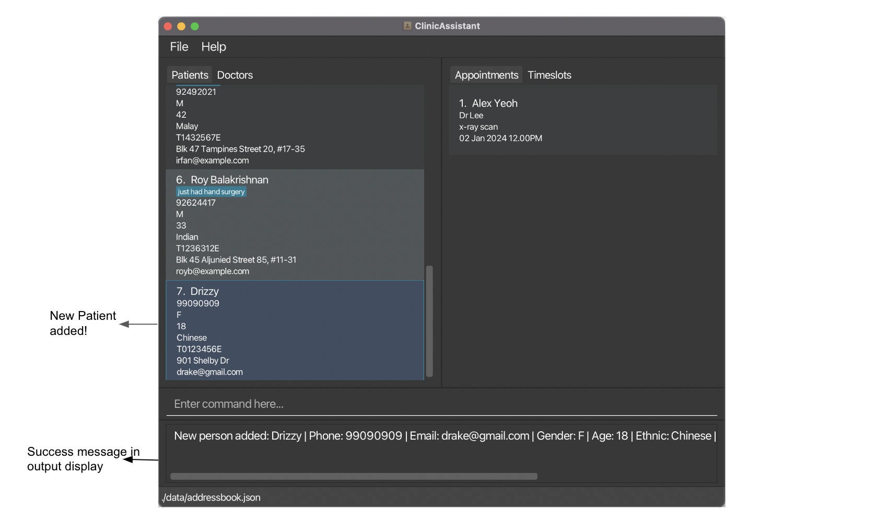

* Invalid input (missing fields): `add /n Drizzy`
  * Output (failure):  
  `Invalid command format!`  
  `add: Adds a person to the address book. Parameters: /n NAME /p PHONE /e EMAIL /g GENDER /age AGE /eth ETHNICITY /ic NRIC NO. /a ADDRESS [/t TAG]...`
  * **To fix:** Add in the missing mandatory fields.

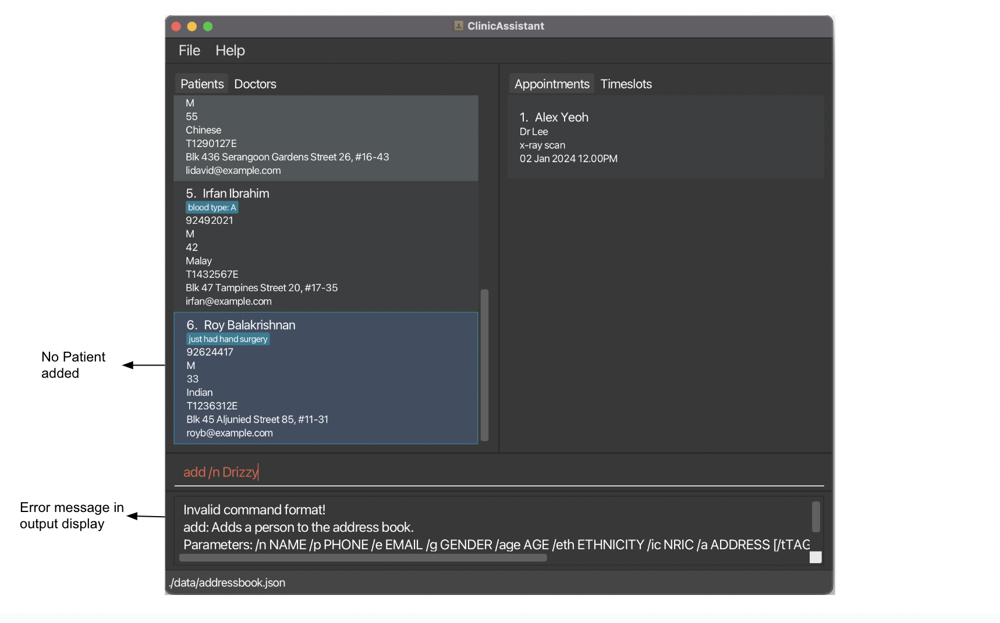

--------------------------------------------------------------------------------------------------------------------

### Adding a doctor: `add_doctor`

Adds a doctor to the clinic records. A doctor has a name, phone number, email, gender, age, and address.

Format: `add_doctor /n NAME /p PHONE_NUMBER /e EMAIL /g GENDER /age AGE /a ADDRESS`

* A doctor has a name, phone number, email, gender, age, address and they are all mandatory.

<box type="info" seamless>

**Note:**
* Doctor's names are case-sensitive.
* You cannot add two Doctors with the same name.
  * Adding two doctors with the names `John Doe` and `John doe` is allowed.
  * Adding two doctors with the names `John Doe` and `John Doe` is not allowed.
</box>

<box type="warning" seamless>

**Warning:**
* Make sure the details of the doctor is correct. As of now, you cannot edit a doctor's details yet.
* To change a doctor's details, you have to first delete the doctor, then re-enter his/her details.
    * Before deleting a doctor, you must make sure he/she does not have any pre-existing appointments. 
  Deleting a doctor deletes his/her appointments too.
</box>

Examples:
* Valid input: `add_doctor /n Dr Lee /p 81824444 /e drlee@gmail.com /g M /age 30 /a 901 Shelby Drive`
    * Output (success):  
      `New Doctor added: Dr Lee | Phone: 81824444 | Email: drlee@gmail.com | Gender: M | Age: 30 | Address: 901 Shelby Drive`

    * 
* Invalid input (missing fields): `add_doctor /n Dr Lee`
    * Output (failure):  
      `Invalid command format!`  
      `add_doctor: Adds a Doctor to clinic assistant.`  
      `Parameters: /n NAME /p PHONE /e EMAIL /g GENDER /age AGE /a ADDRESS`  
      `Example: add_doctor /n John Doe /p 98765432 /e johnd@example.com /g M /age 22 /a 311, Clementi Ave 2, #02-25`  
    * **To fix:** Add in the missing mandatory fields.
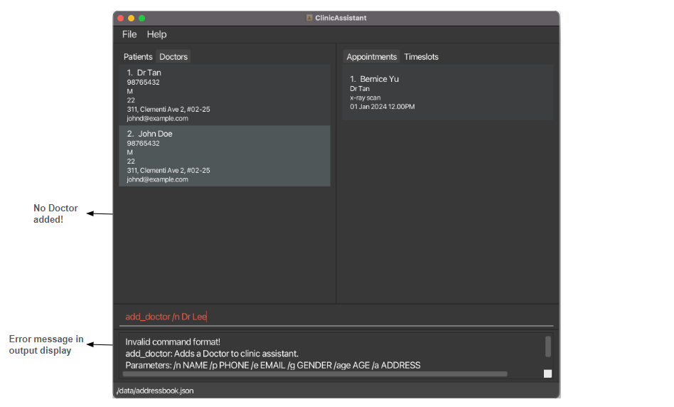
--------------------------------------------------------------------------------------------------------------------

### Adding an appointment: `appt`

Adds a new appointment for the specified patient. An appointment requires the patient's index, the doctor's index, a description, and the appointment date and time.

Format: `appt /for PATIENT_INDEX /doc DOCTOR_INDEX /d DESCRIPTION /on DATE_TIME`

* `PATIENT_INDEX`: Index of the patient for whom the appointment is being made.
* `DOCTOR_INDEX`: Index of the doctor who will handle the appointment.
* `DESCRIPTION`: Brief description of the appointment.
* `DATE_TIME`: Date and time of the appointment in the format dd-MM-yyyy HH:mm (e.g., 01-01-2024 12:00).

<box type="info" seamless>

**Note:**
* The doctor's index must correspond to a valid doctor previously added to the system.
* The appointment's date and time must be in the future.
* Time of the appointment must only be from 9am - 5pm inclusive, on the hour.
* All fields (patient index, doctor index, description, and date/time) are mandatory.
</box>

<box type="warning" seamless>

**Warning:**
* Only one appointment is allowed per timeslot. i.e. 2 doctors cannot have appointments on the same timeslot. This is a current limitation that we are working as part of our future implementations.
  </box>

Examples:
* Valid input: `appt /for 1 /doc 1 /d Blood test /on 01-01-2024 12:00`
    * Output (success):  
      `New appointment added | Patient: Alex Yeoh | Description: Blood test | Date: 01 Jan 2024 12.00 PM`

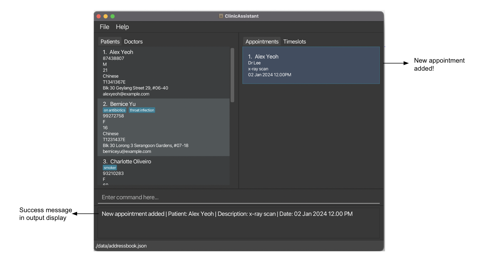
* Invalid input 1 (`DESCRIPTION` not provided): `appt /for 1 /doc 1 /on 01-01-2024 12:00`
    * Output (failure):  
      `Invalid command format! `  
      `appt: Adds a appointment to the patient identified by the index number used in the displayed patient list.`  
      `Parameters: /for PATIENT_INDEX /doc DOCTOR_INDEX /d DESCRIPTION /on DATE_TIME`  
      `Example: appt /for 1 /doc 1 /d x-ray scan /on 02-01-2024 12:00` 
    * **To fix:** Add in the missing description field.

* Invalid input 2 (invalid `DATE_TIME`): `appt /for 1 /doc 1 /d Blood test /on tuesday`
    * Output (failure):  
      `Date must be in dd-MM-yyyy HH:mm format.`  
      `Date & time must be after the current time.`  
      `Time of appointment must be on the hour, between 9 AM and 5 PM inclusive.`  
    * **To fix:** Enter a valid `DATE_TIME` in dd-MM-yyy HH:mm format.
      
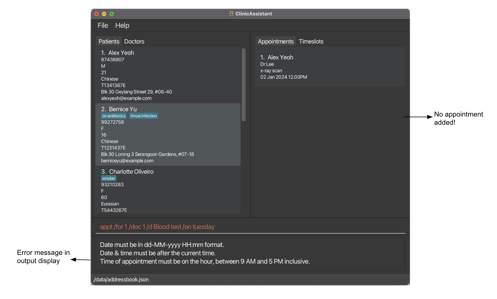

--------------------------------------------------------------------------------------------------------------------

### Listing all patients : `list`

Shows a list of all people in the clinic records.

Format: `list`

Examples:
* Valid input: list
  * Output (success):  
  `Listed all patients`

--------------------------------------------------------------------------------------------------------------------

### Listing all appointments : `list_appt`

Removes all conditions previously applied to the appointments list and shows all appointments in Clinic Assistant.

Format: `list_appt`

<box type="info" seamless>

**Note:**
* Additional text after `list_appt` will be ignored and not affect the output.
  * E.g. `list_appt 1` will still show all appointments in Clinic Assistant.

</box>

Example:
* Valid input: `list_appt`
    * Output (success): `Listed all appointments`  
        All conditions are removed and all appointments are showed.

--------------------------------------------------------------------------------------------------------------------

### Editing a patient: `edit`

Edits an existing patient from the clinic records.

Format: `edit INDEX [/n NAME] [/p PHONE] [/e EMAIL] [/g GENDER] [/age AGE] [/eth ETHNIC] [/ic NRIC] [/a ADDRESS] [t/TAG]…​`

* Edits the patient at the specified INDEX. 
The index refers to the index number shown in the displayed patient list. 

<box type="info" seamless>

**Note:**
* The index **must be a positive integer** 1, 2, 3, …​ 
* At least one of the optional fields must be provided. 
* Existing values will be updated to the input values. 
* When editing tags, the existing tags will be removed ie adding of tags is not cumulative. 
* You can remove all the person’s tags by typing `/t` without specifying any tags after it. 
</box>

Examples:
* Valid input 1: `edit 1 /p 91234567 /e johndoe@example.com`
    * Output (success):  
  `Edited Person: Alex Yeoh | Phone: 91234567 | Email: johndoe@example.com | Gender: M | Age: 21 | Ethnic: Chinese | NRIC: T1341367E | Address: Blk 30 Geylang Street 29, #06-40 | Tags:`

* Valid input 2: `edit 2 /n Betsy Crower /t`
  * Output (success):  
  `Edited Person: Betsy Crower | Phone: 99272758 | Email: berniceyu@example.com | Gender: F | Age: 16 | Ethnic: Chinese | NRIC: T1231437E | Address: Blk 30 Lorong 3 Serangoon Gardens, #07-18 | Tags: `
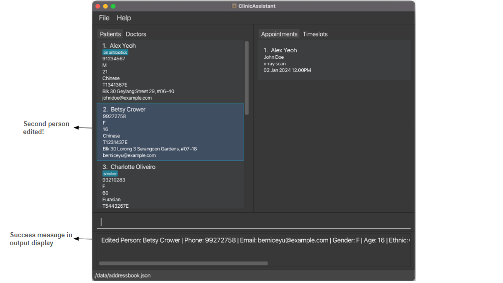
--------------------------------------------------------------------------------------------------------------------

### Editing an appointment: `edit_appt`

Edits an existing appointment from the clinic records.

Format: `edit_appt INDEX [/d DESCRIPTION] [/on DATE_TIME]`

* Edits the appointment at the specified `INDEX`. The index refers to the index number shown in the displayed appointment list.
* **At least one** field must be edited.
* Existing values will be updated to the input values.

<box type="info" seamless>

**Note:**
* The index **must be a positive integer** 1, 2, 3, …​
* Doctors of the appointment cannot be edited, planned addition in future implementations.
  </box>

Examples:
* Valid input: `edit_appt 1 /d changed to x-ray scan /on 01-01-2024 09:00`
    * Output (success):  
      `Newly edited appointment | Patient: Alex Yeoh | Description: changed to x-ray scan | Date: 01 Jan 2024 09.00 AM`
* Invalid input 1 (no fields edited): `edit_appt 1`
    * Output (failure):  
      `At least one field to edit must be provided: [/d DESCRIPTION][/on DATE_TIME]`  
      `Example: edit_appt 1 /on 01-01-2024 00:00`  
    * **To fix:** Edit at least one of the fields.
* Invalid input 2 (invalid `DATE_TIME`): `edit_appt 1 /on tuesday`
    * Output (failure):  
      `Date must be in dd-MM-yyyy HH:mm format.`  
      `Date & time must be after the current time.`  
      `Time of appointment must be on the hour, between 9 AM and 5 PM inclusive.`  
    * **To fix:** Enter a valid `DATE_TIME` in dd-MM-yyy HH:mm format.

--------------------------------------------------------------------------------------------------------------------

### Deleting a patient : `delete`

Deletes a patient from the clinic records via the specified index.

Format: `delete INDEX`

* Deletes the patient at the specified `INDEX` in the list under **Patients**.
* The `INDEX` refers to the index number shown in the list in front of the name.
* The `INDEX` **must be a positive integer** 1, 2, 3, 4, …​

<box type="info" seamless>

**Note:**
* The command word `delete` is case-sensitive. E.g. `Delete INDEX` will not work
* INDEX must be a positive integer in the patient list, starting from 1, with the last index as the limit.
  </box>

<box type="warning" seamless>

**Warning:**
* Deleting a patient will delete **all** their information and appointments and this is **UNRECOVERABLE**
  </box>

Examples:
* Valid input: `delete 1`
    * Output (success):  
    `Deleted Person: Alex Yeoh | Phone: 91234567 | Email: johndoe@example.com | Gender: M | Age: 21 | Ethnic: Chinese | NRIC: T1341367E | Address: Blk 30 Geylang Street 29, #06-40 | Tags: [on antibiotics] from clinic records`
  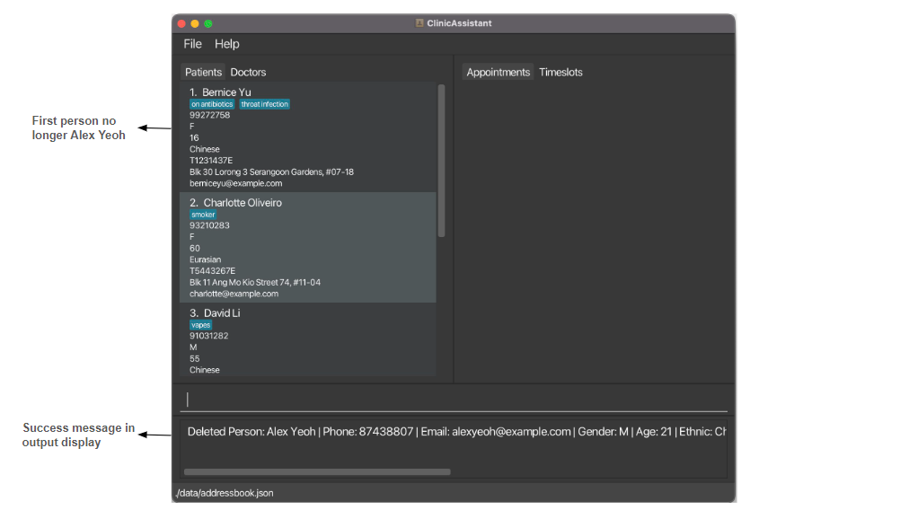
* Invalid input 1 (no `INDEX` provided): `delete `
    * Output (failure):  
      `Invalid command format! `  
      `delete: Deletes the patient with the index number used in the clinic records.`  
      `Parameters: INDEX (must be a positive integer in the list)`  
      `Example: delete 1` 
    * **To fix**: Enter an `INDEX` such as `delete 2`
    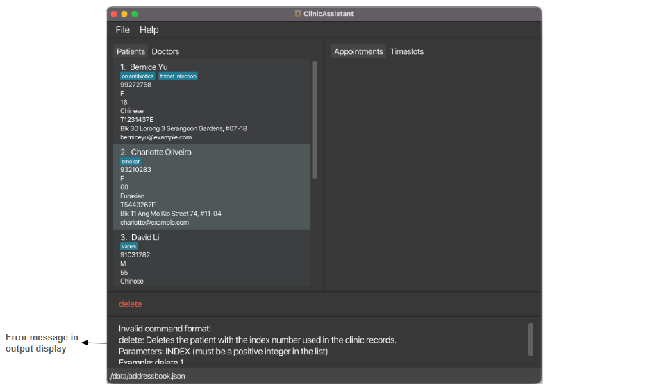
* Invalid input 2 (`INDEX` out-of-bounds): `delete 10000`
    * Output (failure):  
      `The patient index provided is invalid`  
    * **To fix**: Enter an `INDEX` displayed in `Patients` tab.
    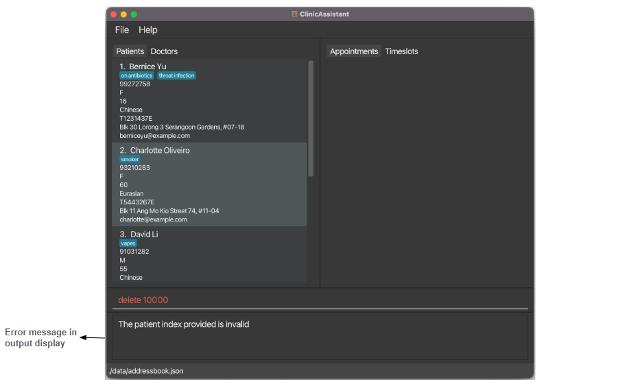
* Invalid input 3 (`INDEX` provided as word): `delete one`
    * Output (failure):  
      `INDEX entered must be an integer!.`  
    * **To fix**: Enter an `INDEX` that that is an integer.
--------------------------------------------------------------------------------------------------------------------

### Deleting a doctor : `delete_doctor`

Deletes the specified doctor from the clinic records.

Format: `delete_doctor INDEX`

* Deletes the doctor at the specified `INDEX`.
* `INDEX` refers to the index number shown on the displayed doctor list.
* User could first click on the doctor tab to show the doctor list.

<box type="info" seamless>

**Note:**
* The command is case-sensitive. E.g. `Delete_doctor INDEX` will not work
* The index **must be a positive integer** 1, 2, 3, …​
  </box>

<box type="warning" seamless>

**Warning:**
* Before deleting a doctor, you must make sure he/she does not have any pre-existing appointments.
Deleting a doctor deletes his/her appointments too.
</box>

Examples: 
initial Doctor list:
* Valid input: `delete_doctor 1`
    * Output (success):  
      `Deleted Doctor: Dr Lee | Phone: 81824444 | Email: drlee@gmail.com | Gender: M | Age: 30 | Address: 901 Shelby Drive from clinic records`
* Invalid input 1 (non-positive integer): `delete_doctor 0`
    * Output (failure):  
      `Invalid command format!` 
      `delete_doctor: Deletes the doctor with the index number used in the clinic records.` 
      `Parameters: INDEX (must be a positive integer in the list)` 
      `Example: delete_doctor 1` 
    * **To fix**: Enter an `INDEX` displayed in `Doctors` tab.
* Invalid input (`INDEX` out-of-bounds): `delete_doctor 2`
    * Output (failure):  
      `The doctor index provided is invalid` 
    * **To fix**: Enter an `INDEX` displayed in `Doctors` tab.

--------------------------------------------------------------------------------------------------------------------

### Deleting an appointment : `delete_appt`

Deletes an appointment from the clinic records via the specified index.

Format: `delete_appt INDEX`
* Deletes the appointment at the specified `INDEX`
* `INDEX` refers to the index number shown on the displayed appointment list.
* User could use `list_appt` to display all the appointments in the registra first

<box type="info" seamless>

**Note:**  
* The command is case-sensitive. E.g. `Delete_appt INDEX` will not work
* The index **must be a positive integer** 1, 2, 3, …​
</box>

Examples: 
initial Appointment list:
* Valid input: `delete_appt 1`
    * Output (success):  
      `Deleted Appointment seedu.address.model.appointment.Appointment{description=description details, dateTime=2024-01-02T12:00} of Alex Yeoh | Phone: 87438807 | Email: alexyeoh@example.com | Gender: M | Age: 21 | Ethnic: Chinese | NRIC: T1341367E | Address: Blk 30 Geylang Street 29, #06-40 | Tags: [friends]`
* Invalid input 1 (non-positive integer): `delete_appt 0`
    * Output (failure):  
      `Invalid command format:`  
      `delete_appt: Deletes the Appointment identified by the index number used in the displayed appointments list.`  
      `Parameters: INDEX (must be a positive integer) Example: delete_appt 1` 
   * **To fix**: Enter an `INDEX` displayed in `Appointments` tab.
* Invalid input (`INDEX` out-of-bounds): `delete_appt 2`
    * Output (failure):  
      `The patient index provided is invalid` 
    * **To fix**: Enter an `INDEX` displayed in `Appointments` tab.

--------------------------------------------------------------------------------------------------------------------

### Finding patient details by name: `find`

Finds patients whose name contains the given keyword.

Format: `find KEYWORD`
* Only the name is searched for.

<box type="info" seamless>

**Note:**
* The search is case-insensitive. e.g `hans` will match `Hans`.
</box>

Examples:
* Valid input: `find Bernice`
    * Output (success):  
    `1 patient found!`
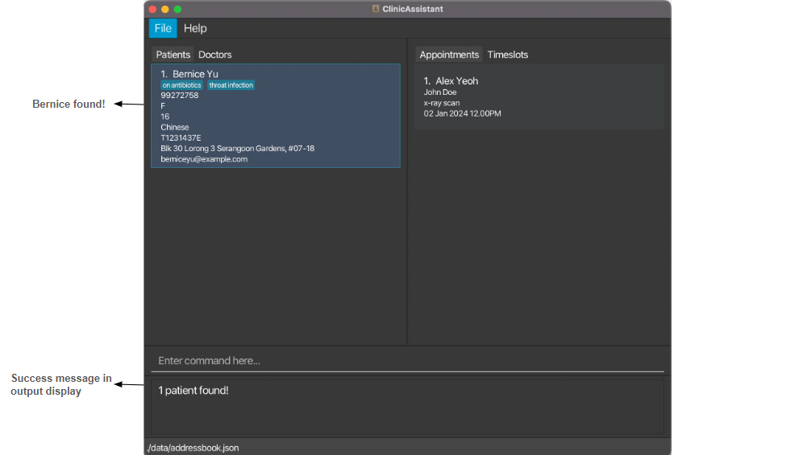
--------------------------------------------------------------------------------------------------------------------

### Finding patient details by nric: `find_nric`

Finds the patient who has the given NRIC.

Format: `find_nric NRIC`

<box type="info" seamless>

**Note:**
* The search is not case-sensitive. ie the NRIC `T1234567E` is equivalent to the NRIC `t1234567e`.  
* The inputted NRIC must be valid. The NRIC must start with 'S' or 'T' and contain 7 digits between the 2 alphabets.
ie `V1234567E` and `S123456eE` are invalid NRICs
</box>

Examples:
* Valid Input 1: `find_nric T1231437E`
    * Output (success):  
    `1 patient found!`
* Valid input 2: `find_nric t1234567e`
    * Output (failure, if no patient with this NRIC exists in the list):  
  `No patients found!`
* Invalid input (wrong `NRIC` format): `find_nric S123v456X`
    * Output (failure):  
    `Invalid command format!`  
    `NRICs should contain 7 digits, with S or T at the beginning and a letter at the end`
    * **To fix**: Enter a valid NRIC format.

--------------------------------------------------------------------------------------------------------------------

### Finding appointment by patient name or date: `find_appt`

Filters appointments by one or more fields using their prefixes, and their corresponding inputs (name and date).

Format: `find_appt [/n KEYWORD [MORE_KEYWORDS]...][/on DATE]`

* `NAME`: One or more keywords to filter by the patient's name (e.g. `John Simba` will search for appointments of patients whose name contains `John` or `Simba`). It must be non-empty alphanumeric characters and spaces.
* `DATE`: Date of the appointment to filter by in the format dd-MM-yyyy (e.g. `01-01-2024`).

<box type="info" seamless>

**Note:**
* The prefixes that can be used are listed in the parameter list above.
* The name filter is case-insensitive, e.g. `han` will match `Han`.
* The user can filter using one field or both fields at once.
  * e.g. `find_appt /n John /on 01-01-2024` will return appointments of patients with name `John` that falls on 1 Jan 2024.
* If there are no prefixes keyed in, an error message will be shown with the correct command format.
* If the input after a prefix is empty/invalid, an error message with the constraint of the field will be shown.

</box>

<box type="warning" seamless>

**Warning:**
* The name filter must be full words, e.g. `han` will not match `Hannah`.
* Date parameter must be in the format dd-MM-yyyy e.g. `01-01-2024`.
* Both fields are optional, but at least 1 must be given. e.g. `find_appt` with no field inputs will not work. 
* One filter can only be used once in a single command. e.g. `find_appt /n John /n Simba` will not work.
  
</box>

Examples:
* Valid input: `find_appt /n Bernice /on 01-01-2024`
    * Output (success): `1 appointment found!`  

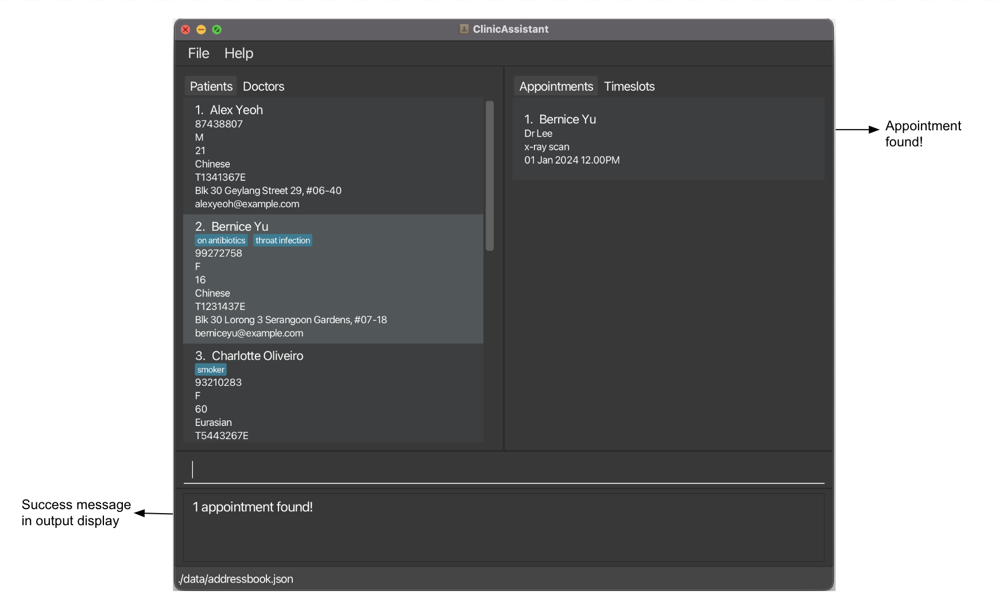

* Invalid input 1 (no prefixes provided): `find_appt`
    * Output (failure):  
      `Invalid command format!`  
      `find_appt: Finds all appointments with patient name by keywords (case-insensitive) or date and displays them as a list with index numbers.`  
      `Parameters: [/n KEYWORD [MORE_KEYWORDS]...][/on DATE]` 
      `Example: find_appt /n alice bob charlie /on 01-01-2024` 
    * **To fix**: Enter at least 1 field to find.

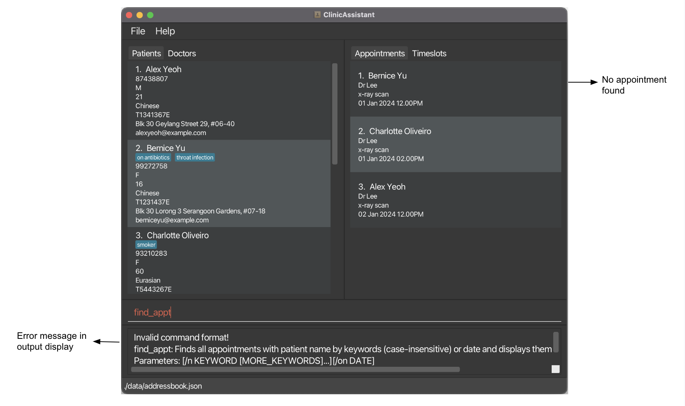

* Invalid input 2 (invalid `DATE`): `find_appt /n John /on 1 Jan 2024`
    * Output (failure):  
      `DATE must be in format dd-MM-yyyy`  
    * **To fix:** Enter a valid `DATE` in dd-MM-yyy format.

--------------------------------------------------------------------------------------------------------------------

### Viewing available timeslots : `view`

Displays all **available** timeslots on the specified date by the user.

Format: `view /on DATE`

* Displays all available timeslots that can be booked on the `DATE` under the `Timeslots` tab.
* Any Timeslot displayed under the `Timeslot` tab can be used to book an appointment.

After calling the command, click on the timeslot tab to see something similar to the below:

<box type="info" seamless>

**Note:**
* The `DATE` **must be a valid date** on the calendar in the **exact** format `dd-MM-yyyy`.
* Timeslots for appointments are fixed at 1 hour each, **starting from 9AM to 5PM**.
* The **very first time** this command is called, the header showing the date will **not** be shown (refer to known issues).
* Header will be shown for every subsequent view command.
  </box>

<box type="warning" seamless>

**Warning:**
* Clearing all patients will clear the available timeslots too.
* The `Timeslot` tab will be **deactivated** whenever there is **no available timeslots**. Please enter the command to activate it again when there is at least 1 timeslot.
  </box>

Examples: 
* Valid input: `view /on 01-01-2024`
    * Output (success):  
      `All Available Timeslot(s) on Jan 01, 2024 Listed!`
  

* Invalid input 1 (invalid `DATE`): `view /on 02/01/2024`
    * Output (failure):  
      `DATE must be in format dd-MM-yyyy`  
    * **To fix**: Use `-` as date separator such as `view /on 02-01-2024`
    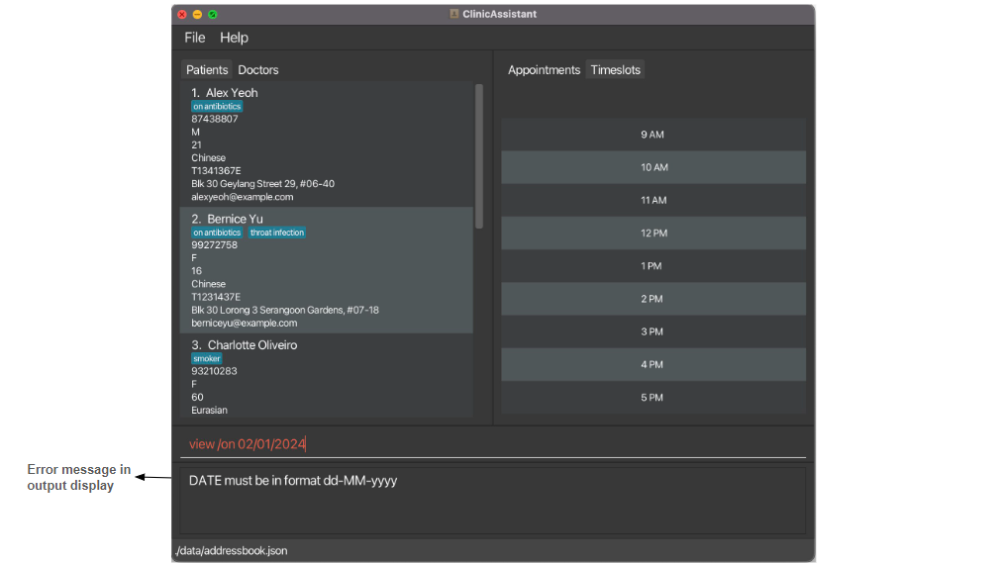
* Invalid input 2 (`DATE` has past): `view /on 02-01-1999`
    * Output (failure):  
      `DATE entered has past already!`  
    * **To fix**: Enter a `DATE` that has not passed such as `view /on 01-10-2030`.
      

--------------------------------------------------------------------------------------------------------------------

### Clearing all patients : `clear`

Clears all patients from ClinicAssistant.

Format: `clear`

--------------------------------------------------------------------------------------------------------------------

### Exiting the program : `exit`

Exits ClinicAssistant.

Format: `exit`

--------------------------------------------------------------------------------------------------------------------

### Saving the data

ClinicAssistant data are saved in the hard disk automatically after any command that changes the data. There is no need to save manually.

--------------------------------------------------------------------------------------------------------------------

### Editing the data file

ClinicAssistant data are saved automatically as a JSON file `[JAR file location]/data/clinicassistant.json`. Advanced users are welcome to update data directly by editing that data file.

**Caution:**
If your changes to the data file makes its format invalid, ClinicAssistant will discard all data and start with an empty data file at the next run.  Hence, it is recommended to take a backup of the file before editing it.
</box>

## FAQ

**Q**: How do I transfer my data to another Computer? 
**A**: Install the app in the other computer and overwrite the empty data file it creates with the file that contains the data of your previous ClinicAssistant home folder.
**Q**: How do I know why my input is invalid?  
**A**: Ouput messages explaining the reason for error will be shown in the output display box. Otherwise, our user guide has some examples of invalid inputs and possible reasons these inputs may be erratic.

--------------------------------------------------------------------------------------------------------------------

## Known issues

1. **When using multiple screens**, if you move the application to a secondary screen, and later switch to using only the primary screen, the GUI will open off-screen. The remedy is to delete the `preferences.json` file created by the application before running the application again.
2. **When calling `view` command for the very first time**, there will be no header showing the specified date as there is no ambiguity as to which date the user is searching for. Only on subsequent calls will the header be shown.

## Command summary

Action     | Format, Examples
-----------|----------------------------------------------------------------------------------------------------------------------------------------------------------------------
**Add**    | `add /n NAME /p PHONE_NUMBER /e EMAIL /g GENDER /age AGE /eth ETHNICITY /ic NRIC /a ADDRESS [/t TAG]…​`   e.g., `add /n James Ho /p 81808888 /e jamesho@example.com /g M /age 22 /eth Chinese /ic T1234567E /a 123, Clementi Rd, 1234665 /t allergic to dust`
**Add Doctor**  | `add_doctor /n NAME /P PHONE_NUMBER /e EMAIL /g GENDER /age AGE /a ADDRESS`   e.g., `add_doctor /n John Doe /p 98765432 /e johnd@example.com /g M /age 22 /a 311, Clementi Ave 2, #02-25`
**Add Appointment**  | `appt /for PATIENT_INDEX /doc DOCTOR_INDEX /d DESCRIPTION /on DATE_TIME`   e.g., `appt /for 1 /doc 1 /d x-ray scan /on 02-01-2024 12:00`
**Edit**   | `edit INDEX [/n NAME] [/p PHONE] [/e EMAIL] [/g GENDER] [/age AGE] [/eth ETHNIC] [/ic NRIC] [/a ADDRESS] [/t TAG]…​`   e.g., `edit 1 /a 3 NUS Computing Drive`
**Edit Appointment** | `edit_appt INDEX [/d DESCRIPTION] [/on DATE_TIME]`   e.g., `edit_appt 1 /d changed to x-ray scan`
**Clear**  | `clear`
**Delete** | `delete INDEX`  e.g., `delete 3`
**Delete Doctor** | `delete_doctor INDEX`  e.g, `delete_doctor 3`
**Delete Appointment** | `delete_appt INDEX`   e.g., `delete_appt 3`
**Find**   | `find KEYWORD`  e.g., `find john`
**Find by NRIC**   | `find_nric NRIC`   e.g., `find_nric T1234567E`
**Find Appointment** | `find_appt [/n KEYWORD] [/on DATE]` e.g., `find_appt /n John /on 01-01-2024 12:00`
**List**   | `list`
**View**   | `view /on DATE`  e.g., `view /on 02-01-2024`
**Help**   | `help`

[Back to top](#clinicassistant-user-guide)
